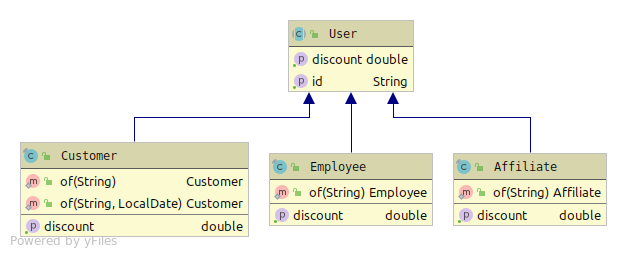

# Retail system
## How to run the application
This application is typical Spring boot application you can run it
by following comment
```
./gradlew bootRun
```
The system will print something like 
```
2020-04-09 12:30:15.938  INFO 32137 --- [  restartedMain] c.r.d.a.persistence.FakeDataLoader       : Create Product Data
2020-04-09 12:30:15.991  INFO 32137 --- [  restartedMain] c.r.d.a.persistence.FakeDataLoader       : Product first ProductEntity{productType=ANY, bigDecimal=80.0} BaseEntity{id='349ee67d-2d59-478a-876e-5a3dc2cceb1f'}
2020-04-09 12:30:16.001  INFO 32137 --- [  restartedMain] c.r.d.a.persistence.FakeDataLoader       : Product second ProductEntity{productType=GROCERIES, bigDecimal=10.0} BaseEntity{id='6a570120-b469-4b5a-9b00-da307fb3422c'}
2020-04-09 12:30:16.004  INFO 32137 --- [  restartedMain] c.r.d.a.persistence.FakeDataLoader       : Product third ProductEntity{productType=GROCERIES, bigDecimal=10.0} BaseEntity{id='7807a2cc-7b7c-49fc-97e2-2e1733532166'}
2020-04-09 12:30:16.004  INFO 32137 --- [  restartedMain] c.r.d.a.persistence.FakeDataLoader       : Create USER data
2020-04-09 12:30:16.008  INFO 32137 --- [  restartedMain] c.r.d.a.persistence.FakeDataLoader       : User first UserEntity{type=AFFILIATE} BaseEntity{id='819ecc0f-998a-493c-8882-48ec680a3795'}
2020-04-09 12:30:16.017  INFO 32137 --- [  restartedMain] c.r.d.a.persistence.FakeDataLoader       : User second UserEntity{type=CUSTOMER} BaseEntity{id='45c14182-b5ae-40cf-a817-a69c8605af46'}
2020-04-09 12:30:16.021  INFO 32137 --- [  restartedMain] c.r.d.a.persistence.FakeDataLoader       : User second UserEntity{type=EMPLOYEE} BaseEntity{id='a3161149-df9a-413f-ad90-8556f1445384'}

```
This information provides you fake data about products and customers, you need to use their ID in order to use the system

## How to test the application
When you run the application and want to test it you can open [swagger API](http://localhost:8080/swagger-ui.html#/)

## How to generate code coverage report
You need to execute:
```
./gradlew test jacocoTestReport
```
Then you can find the HTML report in ``{projectHome}/build/reports/jacoco/test/html`` and open the index.html

## UML diagram of domain model

